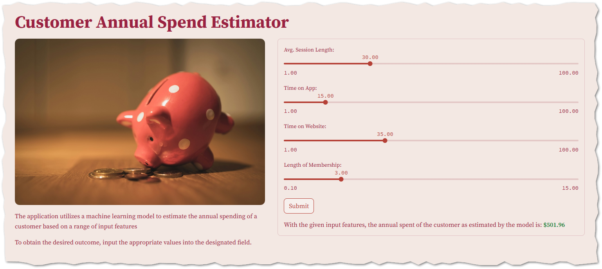
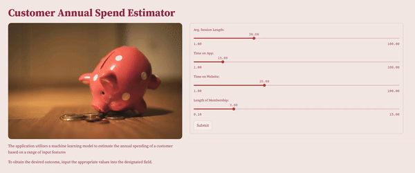

# ![Project Logo][project_logo]

---

<h4 align="center"> Developing a Machine Learning Web Application to Estimate Annual Spend of Customers using <a href="https://www.python.org/" target="_blank">Python</a> and <a href="https://streamlit.io/" target="_blank">Streamlit</a></h4>

<p align='center'>


</p>


<p align="center">
  <a href="#overview">Overview</a> •
  <a href="#prerequisites">Prerequisites</a> •
  <a href="#architecture">Architecture</a> •
  <a href="#demo">Demo</a> •
  <a href="#support">Support</a> •
  <a href="#license">License</a>
</p>


## Overview

The project aims to create a web application that enables end users to estimate the annual spend amount of a customer when certain features are provided.

The application utilizes a trained model that has been developed using historical data and by leveraging this model, users can input the values of different features to obtain an estimation of the customer annual spend.

The web application serves as a valuable tool for business owners to make informed decisions and plan their operations accordingly, taking into account the anticipated annual spend of customers.

Here is the snapshot of the web application interface:

<p align='center'>
  <a href="">
    
  </a>
</p>

The machine learning model employs the *multiple linear regression (MLR)* algorithm, utilizing four numerical features to predict the target variable.

Thorough evaluation reveals an adjusted R2 score of $0.99$ and an RMSE score of $10.48$. Prior to training, features are standardized using standard scalar normalization.

The project repository exhibits the following structure:

```
Spend-Estimator/
├── 📁.github
├── 📁.streamlit
├── 📁conf
├── 📁data/
│   ├── 📁raw
│   ├── 📁processed
│   ├── 📁test
│   └── 📁train 
├── 📁notebooks
├── 📁src/
│   ├── 📁components
│   ├── 📁pipelines
│   ├── 📁utils
│   ├── 🐍constants.py
│   ├── 🐍exception.py
│   └── 🐍logger.py
├── 📁models/
│   ├── 📁predictions
│   ├── 📁preprocessors
│   ├── 📁scores
│   └── 📁trained
├── 📁logs
├── 📁reports
├── 📁resources
├── 🐍main.py
├── 🐍app.py
├── 🐍template.py
├── 🔒poetry.lock
├── 📇pyproject.toml
├── 🗒️requirements.txt
├── 📜.gitignore
├── 🔑LICENSE
└── 📝README.md
```
<details>
<summary>
   <strong>💡 Repository Structure Details</strong>
</summary>
<br>

To help you navigate through the project, here’s a concise guide to the repository’s structure, detailing what each directory contains and its purpose within the project:

- **`📁.github`** - Contains GitHub-related configuration files like workflows for CI/CD.
- **`📁.streamlit`** - Holds Streamlit-specific configuration files for web app settings.
- **`📁conf`** - Configuration files and schema for the project.
- **`📁data/`**
  - **`📁raw`** - Original, unmodified data files.
  - **`📁processed`** - Data that has been cleaned and transformed for analysis.
  - **`📁test`** - Data sets used for testing the model's performance.
  - **`📁train`** - Data sets used for training the machine learning models.
- **`📁notebooks`** - Jupyter notebooks for exploratory data analysis and model experimentation.
- **`📁src/`**
  - **`📁components`** - Modular components used across the project.
  - **`📁pipelines`** - Data processing and machine learning pipelines.
  - **`📁utils`** - Utility scripts for common tasks throughout the project.
  - **`🐍constants.py`** - Central file for constants used in the project.
  - **`🐍exception.py`** - Custom exception classes for error handling.
  - **`🐍logger.py`** - Logging configuration and setup.
- **`📁models/`**
  - **`📁predictions`** - Output predictions from the model.
  - **`📁preprocessors`** - Scripts for data preprocessing steps.
  - **`📁scores`** - Model evaluation metrics and scoring information.
  - **`📁trained`** - Serialized versions of trained models.
- **`📁logs`** - Contains auto-generated logs for event and error tracking, not included in Git.
- **`📁reports`** - Generated analysis reports and insights.
- **`📁resources`** - Additional resources like images or documents used in the project
- **`🐍main.py`** - Script to orchestrates the project's workflow. It sequentially executes the pipeline scripts
- **`🐍app.py`** - The Streamlit web application entry point.
- **`🐍template.py`** - Template script for standardizing code structure.
- **`🔒poetry.lock`** - Lock file for Poetry to ensure reproducible builds.
- **`📇pyproject.toml`** - Poetry configuration file for package management.
- **`🗒️requirements.txt`** - List of Python package requirements.
- **`📜.gitignore`** - Specifies intentionally untracked files to ignore.
- **`🔑LICENSE`** - The license file for the project.
- **`📝README.md`** - The introductory documentation for the project.

</details>

## Prerequisites

### Tech Stack Prerequisites
![Python] ![Numpy] ![Pandas] ![Matplotlib] ![scikit-learn] ![Streamlit]

To effectively engage with this project, possessing a robust understanding of the skills listed below is advisable:

- Core comprehension of Python, Machine Learning, and Modular programming
- Acquaintance with libraries such as NumPy, Pandas, Matplotlib, Scikit-Learn, and Streamlit
- Acquaintance with the Python libraries specified in the 🗒️[requirements.txt][requirements] document

These competencies will facilitate a seamless and productive journey throughout the project.

### Development Environment Prerequisites
![Anaconda] ![Poetry] ![VS_code] ![Jupyter_Notebook] ![Notepad_plus_plus] ![Obsidian] ![Figma] ![Clickup]

Application selection and setup may vary based on individual preferences and system setups.

The development tools I've employed for this project are:
- **Anaconda** / **Poetry**: Utilized for distribution and managing packages
- **VS Code**: Employed for writing and editing code
- **Jupyter Notebook**: Used for data analysis and experimentation
- **Notepad++**: Served as an auxiliary code editor
- **Obsidian**: Utilized for documenting project notes
- **Figma**: Used for crafting application UI/UX designs
- **Click Up**: Employed for overseeing project tasks

### Automation Integration Necessities
![GitHubActions]

Integrating process automation is entirely elective, as is the choice of the automation tool.

In this project, **GitHub Actions** has been selected to automate the machine learning model development process as needed.

Should there be a need to adjust hyperparameters or data-related settings, simply update the YAML configurations, and the entire development workflow can be executed directly from the repository.


## Architecture

The architectural design of this project is transparent and can be readily comprehended with the assistance of the accompanying diagram illustrated below:

![Process Architecture][process_workflow]

The project's architectural framework encompasses the following key steps:

### Model Development
The model development process begins with data collection, followed by cleaning and transforming the data to create a clean dataset. This dataset is then split into training and test sets.

After preparing a clean training dataset, we perform necessary imputations and standardization to prepare the scaled training set. This set is then used to train the machine learning model. The model development involves testing different hyperparameters and evaluating the model against the test dataset to optimize the ML model's performance.

Once optimized, the ML model is serialized and integrated into a web application, allowing end users to interact with it and receive predictions based on their input.


### User Interaction

The user interaction with the web application is intuitive and user-friendly. Users begin by entering their data through a simple slider selection, where they can select values for various features that the model uses to make predictions.

This process is designed to be straightforward, even for those with little to no technical background, ensuring that the application is accessible to a wide audience.

### Data Retrieval

Once the user submits their data, the web application processes the input using the serialized machine learning model. 

The model quickly analyzes the input data, applies the necessary algorithms, and computes the predictions. This step is performed efficiently to minimize wait time and enhance the user experience.

### User Output

The results are then presented to the user in a clear and understandable format in the web application.

The goal is to make the output as informative and helpful as possible, allowing users to make informed decisions based on the model's predictions.

## Demo

The following illustration demonstrates the process of providing necessary inputs to the web application and the receiving the desired output:

<p align='center'>
  <a href="https://link_to_webapp.streamlit.app/">
    
  </a>
</p>

> Access the web application by clicking here: **[Web App Name][webapp_link]**


## Support

Should you wish to inquire, offer feedback, or propose ideas, don’t hesitate to contact me via the channels listed below:

[![Linkedin Badge][linkedinbadge]][linkedin] [![Twitter Badge][twitterbadge]][twitter] [![Gmail Badge][gmailbadge]][gmail]

Discover and engage with my content on these platforms:

[![Linktree Badge][linktreebadge]][linktree] [![Youtube Badge][youtubebadge]][youtube] [![GitHub Badge][githubbadge]][github] [![Medium Badge][mediumbadge]][medium]  [![Substack Badge][substackbadge]][substack] 

To express your support for my work, consider [buying me a coffee][buymeacoffee] or, [donate through Paypal][paypal]

[![Buy Me a Coffee][buymeacoffeebadge]][buymeacoffee] [![Paypal][paypalbadge]][paypal]

## License

<a href = 'https://creativecommons.org/licenses/by-nc-sa/4.0/' target="_blank">
    
</a>

This license allows reusers to distribute, remix, adapt, and build upon the material in any medium or format for noncommercial purposes only, and only so long as attribution is given to the creator. If you remix, adapt, or build upon the material, you must license the modified material under identical terms.

---
<p align='center'>
  <a href="https://topmate.io/quantumudit">
    
  </a>
</p>

---

<!-- Image Links -->

[project_logo]: ./resources/readme_images/project_cover_image.png
[process_workflow]: ./resources/readme_images/process_workflow.png

<!-- External Links -->

[webapp_link]: https://link_to_webapp.streamlit.app/
[requirements]: ./requirements.txt

<!-- Project Specific Links -->

[app]: ./app.py
[main]: ./main.py 

<!-- Profile Links -->

[linkedin]: https://www.linkedin.com/in/quantumudit/
[twitter]: https://twitter.com/quantumudit
[medium]: https://medium.com/@quantumudit
[linktree]: https://linktr.ee/quantumudit
[youtube]: https://www.youtube.com/@quantumudit
[github]: https://github.com/quantumudit/
[substack]: https://substack.com/
[gmail]: quantumudit@gmail.com

<!-- Payment Profile Links -->
[buymeacoffee]: https://www.buymeacoffee.com/quantumudit
[paypal]: https://paypal.me/quantumudit


<!-- Shields Profile Links -->

[linkedinbadge]: https://img.shields.io/badge/-uditkumarchatterjee-0e76a8?style=flat&labelColor=0e76a8&logo=linkedin&logoColor=white
[twitterbadge]: https://img.shields.io/badge/-quantumudit-000000?style=flat&labelColor=000000&logo=x&logoColor=white
[gmailbadge]: https://img.shields.io/badge/quantumudit@gmail.com-D14836?style=flat&logo=gmail&logoColor=white
[mediumbadge]: https://img.shields.io/badge/Medium-02b875?style=for-the-badge&logo=medium&logoColor=white
[linktreebadge]:https://img.shields.io/badge/Linktree-1de9b6?style=for-the-badge&logo=linktree&logoColor=white
[youtubebadge]: https://img.shields.io/badge/YouTube-%23FF0000.svg?style=for-the-badge&logo=YouTube&logoColor=white
[substackbadge]: https://img.shields.io/badge/Substack-%23006f5c.svg?style=for-the-badge&logo=substack&logoColor=FF6719
[githubbadge]: https://img.shields.io/badge/github-%23121011.svg?style=for-the-badge&logo=github&logoColor=white

<!-- Shields Payment Links -->

[buymeacoffeebadge]: https://img.shields.io/badge/Buy%20Me%20a%20Coffee-ffdd00?style=for-the-badge&logo=buy-me-a-coffee&logoColor=black
[paypalbadge]: https://img.shields.io/badge/PayPal-00457C?style=for-the-badge&logo=paypal&logoColor=white
[phonepebadge]: https://img.shields.io/badge/Phonepe-54039A?style=for-the-badge&logo=phonepe&logoColor=white
[amazonpaybadge]: https://img.shields.io/badge/AmazonPay-ff9900.svg?style=for-the-badge&logo=Amazon-Pay&logoColor=white
[googlepaybadge]: https://img.shields.io/badge/GooglePay-%233780F1.svg?style=for-the-badge&logo=Google-Pay&logoColor=white

<!-- Shields Tech stack Links -->

[Python]: https://img.shields.io/badge/python-3670A0?style=for-the-badge&logo=python&logoColor=ffdd54
[Jupyter_Notebook]: https://img.shields.io/badge/jupyter-%23FA0F00.svg?style=for-the-badge&logo=jupyter&logoColor=white
[VS_code]: https://img.shields.io/badge/Visual%20Studio%20Code-0078d7.svg?style=for-the-badge&logo=visual-studio-code&logoColor=white
[R]: https://img.shields.io/badge/r-%23276DC3.svg?style=for-the-badge&logo=r&logoColor=white
[RStudio]: https://img.shields.io/badge/RStudio-4285F4?style=for-the-badge&logo=rstudio&logoColor=white
[Notepad_plus_plus]: https://img.shields.io/badge/Notepad++-90E59A.svg?style=for-the-badge&logo=notepad%2b%2b&logoColor=black
[Figma]: https://img.shields.io/badge/figma-%23F24E1E.svg?style=for-the-badge&logo=figma&logoColor=white
[PowerBI]: https://img.shields.io/badge/power_bi-F2C811?style=for-the-badge&logo=powerbi&logoColor=black
[Obsidian]: https://img.shields.io/badge/Obsidian-%23483699.svg?style=for-the-badge&logo=obsidian&logoColor=white
[Trello]: https://img.shields.io/badge/Trello-%23026AA7.svg?style=for-the-badge&logo=Trello&logoColor=white
[NumPy]: https://img.shields.io/badge/numpy-%23013243.svg?style=for-the-badge&logo=numpy&logoColor=white
[Pandas]: https://img.shields.io/badge/pandas-%23150458.svg?style=for-the-badge&logo=pandas&logoColor=white
[Matplotlib]: https://img.shields.io/badge/Matplotlib-%23ffffff.svg?style=for-the-badge&logo=Matplotlib&logoColor=black
[mlflow]: https://img.shields.io/badge/mlflow-%23d9ead3.svg?style=for-the-badge&logo=numpy&logoColor=blue
[scikit-learn]: https://img.shields.io/badge/scikit--learn-%23F7931E.svg?style=for-the-badge&logo=scikit-learn&logoColor=white
[SciPy]: https://img.shields.io/badge/SciPy-%230C55A5.svg?style=for-the-badge&logo=scipy&logoColor=%white
[TensorFlow]: https://img.shields.io/badge/TensorFlow-%23FF6F00.svg?style=for-the-badge&logo=TensorFlow&logoColor=white
[Keras]: https://img.shields.io/badge/Keras-%23D00000.svg?style=for-the-badge&logo=Keras&logoColor=white
[PyTorch]: https://img.shields.io/badge/PyTorch-%23EE4C2C.svg?style=for-the-badge&logo=PyTorch&logoColor=white
[Plotly]: https://img.shields.io/badge/Plotly-%233F4F75.svg?style=for-the-badge&logo=plotly&logoColor=white
[Streamlit]: https://img.shields.io/badge/Streamlit-ff4b4b?style=for-the-badge&labelColor=ff4b4b&logo=streamlit&logoColor=white
[GitHubActions]: https://img.shields.io/badge/github%20actions-%232671E5.svg?style=for-the-badge&logo=githubactions&logoColor=white
[MicrosoftSQLServer]: https://img.shields.io/badge/Microsoft%20SQL%20Server-CC2927?style=for-the-badge&logo=microsoft%20sql%20server&logoColor=white
[Postgres]: https://img.shields.io/badge/postgres-%23316192.svg?style=for-the-badge&logo=postgresql&logoColor=white
[SQLite]: https://img.shields.io/badge/sqlite-%2307405e.svg?style=for-the-badge&logo=sqlite&logoColor=white
[Kaggle]: https://img.shields.io/badge/Kaggle-035a7d?style=for-the-badge&logo=kaggle&logoColor=white
[Anaconda]: https://img.shields.io/badge/Anaconda-%2344A833.svg?style=for-the-badge&logo=anaconda&logoColor=white
[FastAPI]: https://img.shields.io/badge/FastAPI-005571?style=for-the-badge&logo=fastapi
[Tidyverse]: https://img.shields.io/badge/-Tidyverse-1A162D?style=for-the-badge&labelColor=1A162D&logo=tidyverse&logoColor=white
[Poetry]: https://img.shields.io/badge/-Poetry-60A5FA?style=for-the-badge&labelColor=60A5FA&logo=poetry&logoColor=white
[Clickup]: https://img.shields.io/badge/-Click%20Up-7B68EE?style=for-the-badge&labelColor=7B68EE&logo=clickup&logoColor=white
